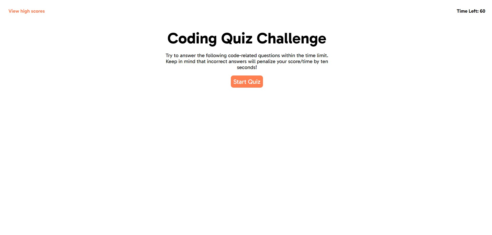

# Coding Quiz

## Description

This is a web-playable quiz to test your coding knowledge. It is scored based on your accuracy and time it takes you to complete the test.

- The application is designed to be responsive and user-friendly.
- High scores are stored in the browser's local storage.
- Users can clear high scores using the "Clear Scores" button.

## Technologies Used

- HTML
- CSS
- JavaScript

## How-to Play

You can play at: <https://bskor66.github.io/code-quiz/>

Click 'Start Quiz' to begin!

## Screenshot

## License

This project is open-source and available under the [MIT License](LICENSE).
